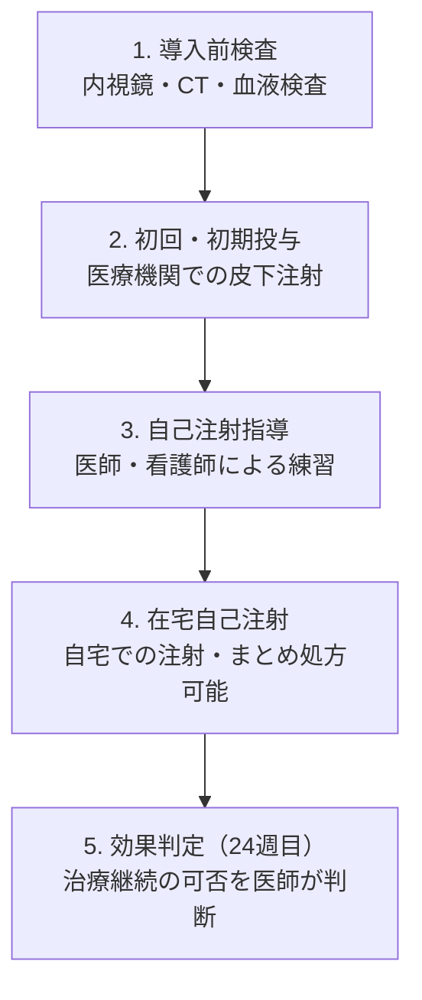

# 好酸球性副鼻腔炎におけるデュピクセント®治療と医療費助成制度のご案内

本説明書は、過去に副鼻腔の手術（内視鏡下副鼻腔手術：ESSなど）を受けられた後、鼻ポリープ（鼻茸：はなたけ）が再発している患者様に対し、注射薬である**デュピクセント®（一般名：デュピルマブ）**を安全に導入し、経済的負担を軽減しながら治療を継続するための情報をまとめたものです。

---

## 1. デュピクセント®治療とは？

デュピクセント®は、体内のアレルギー反応を引き起こす特定の物質（IL-4およびIL-13というサイトカイン）の働きを直接抑える注射薬です。好酸球性副鼻腔炎（こうさんきゅうせいふくびくうえん）による強い鼻づまりや鼻ポリープ、嗅覚障害の劇的な改善効果が期待できます。

### 治療の対象となる条件（基準）
国の定めるガイドラインに基づき、以下の条件をすべて満たす方が保険適用の対象となります。
1.  **手術後の再発例であること：** 過去に副鼻腔の手術を受けていること。（本症例はこの条件を満たしています）
2.  **症状が続いていること：** 通常の治療（ステロイドの飲み薬など）を行っても、鼻づまり、匂いがわからない、鼻水などの症状が8週間以上改善しないこと。
3.  **鼻ポリープの大きさ：** 内視鏡検査において、両側の鼻腔に一定以上の大きさのポリープが確認できること。

---

## 2. 治療のスケジュール

治療は以下のような段階を経て進められます。

1.  **初回〜初期の投与（医療機関）：**
    *   通常、**2週間に1回、300mg（1本）**を皮下に注射します。
    *   注射後の体調変化（アレルギー反応など）を確認するため、最初の数回は院内で医療スタッフが注射を行います。
2.  **自己注射の習得と移行：**
    *   ご自身またはご家族で安全に注射できるよう、指導を受けて練習します。
    *   習得後は、通院回数を減らし、自宅で自己注射（在宅自己注射）を行うことができます。
3.  **効果の判定（開始から24週＝約6ヶ月）：**
    *   治療開始から24週までに医師が効果を評価し、症状や鼻ポリープの大きさが改善している場合は治療を継続します。改善が見られない場合は中止を含めて治療法を再検討します。
    *   症状が十分に安定した後は、医師の判断により**「4週間に1回」に投与間隔を延ばす**こともあります。

---

## 3. 経済的負担と医療費助成制度

デュピクセント®は非常に高価な薬剤（薬価：1本あたり約58,775円※2024年4月改定）ですが、**指定難病（特定医療費助成制度）**や健康保険の制度を利用することで、月々の自己負担額を大幅に抑えることができます。

### 医療費の自己負担額（薬剤費のみの目安）
*   **3割負担（制度未適用）：** 約17,630円 / 1本（月2回で **約35,260円/月**）
*   **2割負担（難病受給者証適用）：** 約11,755円 / 1本（月2回で **約23,510円/月**）
    *   *※これに加え、受給者証に記載された「月額自己負担上限額」が設定されます。*

---

## 4. 難病申請を「並行して行っている」場合の重要事項

現在、好酸球性副鼻腔炎の指定難病申請（難病306番）を並行して進められている場合、受給者証が届くまでの間、以下の対応が必要となります。

### ① 助成は「申請日」から適用されます
受給者証が実際に手元に届くには**約3ヶ月**かかりますが、認定されれば、保健所に申請書が受理された「申請日」に遡って医療費助成が適用されます。

### ② 【最重要】領収書と「診療明細書」をすべて保管してください
受給者証が届くまでの間は、医療機関や薬局の窓口で一旦「3割負担」で支払う必要があります。
受給者証が届いた後に還付手続き（払い戻し）を行うことで、払いすぎた差額分（3割負担分と、2割負担かつ月額上限額との差額）が手元に戻ってきます。

還付請求に必要な以下の書類は、絶対に紛失しないよう保管してください。
*   **医療機関発行の「領収書」および「診療明細書」（原本）**
*   **薬局発行の「領収書」および「調剤明細書」（原本）**

> [!WARNING]
> 領収書だけでなく、治療行為や薬剤の単価が細かく書かれた**「診療明細書」「調剤明細書」も還付手続きに必須**となります。再発行が難しい場合があるため、大切にまとめて管理してください。

### ③ 受給者証が届いた後の還付手続きの流れ
1.  自治体から「特定医療費（指定難病）受給者証」と「自己負担上限額管理票」が郵送で届きます。
2.  申請窓口（管轄の保健所など）に以下の書類を提出し、療養費の還付請求を行います。
    *   特定医療費（指定難病）療養費払戻請求書
    *   保管していた「領収書」および「明細書」（原本）
    *   受給者証のコピー
    *   振込口座が確認できる通帳のコピー
    *   認め印（シャチハタ不可）
3.  手続き完了後、2〜3ヶ月で指定の口座に差額が返金されます。

---

## 5. 経済的負担に関するお問い合わせ・相談窓口

製薬会社サノフィが提供する患者様向けのサポート窓口があります。医療費の自己負担シミュレーションや、自己注射の手順などについて専任スタッフが丁寧にお答えします。

*   **窓口名：デュピクセント®相談室**
*   **電話番号：0120-50-4970**（通話料無料）
*   **受付時間：24時間 365日**
*   **サポートサイト：** [サポート・アレルギー.com](https://www.support-allergy.com/)
    *   *※治療行為自体に関する医学的な相談（効果や副作用の具体的な診断など）はできません。主治医や担当薬剤師へ直接ご相談ください。*

---

## 6. 安全な治療のために（医療安全上の注意点）

デュピクセント®の投与中、稀に以下のような副作用や体調の変化が生じることがあります。

*   **比較的よくみられる副作用：** 注射部位の赤み、かゆみ、腫れなど（一時的なもので自然に消退することが多いです）。
*   **注意すべき重大な兆候：** 急激な息苦しさ、発疹、発熱、関節痛、手足のしびれ、または喘息症状の悪化など。

> [!IMPORTANT]
> もし急激な息苦しさ（呼吸困難）や、体全体の激しいかゆみ・じんましん等のアレルギー症状が出た場合は、直ちに緊急受診するか、救急車を要請してください。また、その他体調に不安がある場合は無理に自己注射を行わず、速やかに当院までご連絡ください。
